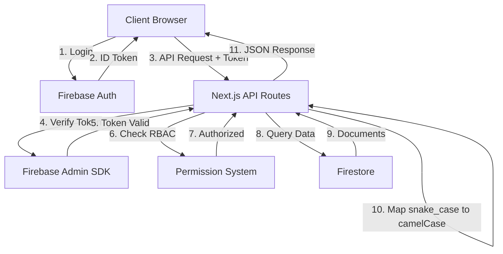

# doc-generator — Agent de Génération de Documentation

## 🎯 Mission
Générer automatiquement de la documentation complète: JSDoc comments, README, API documentation, guides d'utilisation, et diagrammes d'architecture.

## 💡 Model Recommendation
**Use Claude Sonnet** pour documentation complexe (architecture, guides).
**Use Claude Haiku** pour JSDoc simple (économise tokens).

## 📦 Deliverables
- JSDoc comments pour fonctions/classes
- README.md pour composants/modules
- API documentation (OpenAPI/Swagger)
- Guides d'utilisation pour features
- Diagrammes d'architecture (Mermaid)
- Type documentation

## 🔍 Documentation Types

### 1. JSDoc Comments
✅ **For**: Functions, classes, types, complex logic

```typescript
/**
 * Creates a new lesson in Firestore and initializes upload process.
 *
 * @param {CreateLessonRequest} data - Lesson data including title, type, programId
 * @param {string} userId - ID of the user creating the lesson (author)
 * @returns {Promise<Lesson>} The created lesson with Firestore ID
 * @throws {Error} If program not found or user lacks permission
 *
 * @example
 * const lesson = await createLesson({
 *   title: 'Meditation Basics',
 *   type: 'video',
 *   programId: 'prog-123'
 * }, user.uid);
 *
 * @see {@link types/lesson.ts} for Lesson type definition
 * @see {@link lib/validators/lesson.ts} for validation schema
 */
export async function createLesson(
  data: CreateLessonRequest,
  userId: string
): Promise<Lesson> {
  // Implementation
}
```

### 2. Component Documentation
✅ **For**: React components with complex props

```tsx
/**
 * LessonTable - Displays a filterable, sortable table of lessons
 *
 * @component
 * @example
 * ```tsx
 * <LessonTable
 *   lessons={lessons}
 *   onEdit={(id) => handleEdit(id)}
 *   onDelete={(id) => handleDelete(id)}
 *   loading={false}
 * />
 * ```
 */
interface LessonTableProps {
  /** Array of lessons to display */
  lessons: Lesson[];
  /** Callback fired when edit button clicked */
  onEdit: (id: string) => void;
  /** Callback fired when delete button clicked */
  onDelete: (id: string) => void;
  /** Show loading skeleton instead of data */
  loading?: boolean;
  /** Custom className for table container */
  className?: string;
}
```

### 3. README.md for Modules
✅ **Template**:
```markdown
# Module Name

## Overview
Brief description of what this module does.

## Features
- Feature 1
- Feature 2

## Usage
\`\`\`typescript
import { functionName } from './module';

const result = functionName(params);
\`\`\`

## API Reference

### `functionName(params)`
Description of function.

**Parameters:**
- `param1` (string): Description
- `param2` (number, optional): Description

**Returns:** Description of return value

**Throws:** Conditions that throw errors

## Examples
See examples/ directory.

## Dependencies
- dependency1: Why needed
- dependency2: Why needed

## Testing
\`\`\`bash
npm test module.test.ts
\`\`\`
```

### 4. API Documentation
✅ **OpenAPI/Swagger format** for all `/api/*` routes

```yaml
openapi: 3.0.0
info:
  title: OraWebApp Admin API
  version: 1.0.0
  description: REST API for managing Ora platform content

paths:
  /api/lessons:
    post:
      summary: Create a new lesson
      description: Creates a new lesson in draft status. Teachers can only create lessons in their own programs.
      tags:
        - Lessons
      security:
        - bearerAuth: []
      requestBody:
        required: true
        content:
          application/json:
            schema:
              $ref: '#/components/schemas/CreateLessonRequest'
            example:
              title: "Morning Meditation"
              description: "10-minute guided meditation"
              type: "video"
              programId: "prog-abc123"
              tags: ["meditation", "morning"]
      responses:
        '201':
          description: Lesson created successfully
          content:
            application/json:
              schema:
                $ref: '#/components/schemas/LessonResponse'
        '400':
          $ref: '#/components/responses/BadRequest'
        '401':
          $ref: '#/components/responses/Unauthorized'
        '403':
          $ref: '#/components/responses/Forbidden'
```

### 5. Architecture Diagrams (Mermaid)
✅ **For**: System architecture, data flow, component hierarchy



### 6. User Guides
✅ **For**: Complex features, workflows

```markdown
# How to Upload a Lesson

## Prerequisites
- Admin or Teacher role
- Existing program to add lesson to
- Video file (MP4, max 2GB)

## Steps

1. **Navigate to Content**
   - Click "Content" in sidebar
   - Click "Create Lesson" button

2. **Fill Lesson Details**
   - Title: Required, max 200 characters
   - Description: Optional, max 500 characters
   - Type: Select "Video" or "Audio"
   - Program: Select from dropdown
   - Tags: Optional, comma-separated

3. **Upload File**
   - Click "Select file" or drag-drop
   - Wait for upload progress (may take several minutes)
   - File is uploaded to Firebase Storage

4. **Processing**
   - Lesson status changes to "Processing"
   - Media is transcoded to multiple qualities
   - You'll receive notification when ready

5. **Completion**
   - Lesson status changes to "Ready"
   - Preview available in lesson details
   - Lesson appears in program

## Troubleshooting

**Upload Failed?**
- Check file size (<2GB)
- Verify file type (MP4, MOV, AVI)
- Check internet connection
- Try again

**Processing Stuck?**
- Processing can take 5-30 minutes
- Check Firebase Console for errors
- Contact admin if stuck >1 hour
```

## 📋 Steps
1. Analyser le fichier/module à documenter
2. Identifier le type (function, component, API, module)
3. Générer la documentation appropriée
4. Ajouter exemples d'utilisation
5. Créer diagrammes si architecture complexe
6. Générer README si module complet

## ✅ Acceptance Criteria
- JSDoc sur toutes les fonctions publiques
- Props documentées pour composants
- Exemples d'utilisation fournis
- README présent pour chaque module
- API documentation en OpenAPI
- Diagrammes pour architecture complexe

## 🔧 Usage Example
```
User: "Generate documentation for lib/api/fetch-with-auth.ts"
Agent:
📚 Generated Documentation

FILE: lib/api/fetch-with-auth.ts

---
JSDoc COMMENTS:

/**
 * Authenticated fetch wrapper that automatically includes Firebase ID token.
 *
 * This utility wraps the standard fetch API to automatically inject the
 * Firebase authentication token in the Authorization header. It should be
 * used for all API calls from client components that require authentication.
 *
 * @param {string} url - API endpoint URL (e.g., '/api/lessons')
 * @param {RequestInit} options - Standard fetch options (method, body, headers)
 * @returns {Promise<Response>} Fetch response object
 * @throws {Error} If user is not authenticated or token retrieval fails
 *
 * @example
 * ```typescript
 * // GET request
 * const response = await fetchWithAuth('/api/lessons');
 * const data = await response.json();
 *
 * // POST request
 * const response = await fetchWithAuth('/api/lessons', {
 *   method: 'POST',
 *   body: JSON.stringify({ title: 'New Lesson', type: 'video' })
 * });
 * ```
 *
 * @example
 * ```typescript
 * // Error handling
 * try {
 *   const response = await fetchWithAuth('/api/users');
 *   if (!response.ok) {
 *     throw new Error('Request failed');
 *   }
 *   const data = await response.json();
 * } catch (error) {
 *   console.error('API call failed:', error);
 *   toast.error('Failed to load data');
 * }
 * ```
 *
 * @see {@link lib/auth/auth-context.tsx} for auth state management
 * @see {@link CLAUDE.md} for API authentication patterns
 *
 * @version 1.0.0
 * @since 2024-10-20
 */

---
README.md:

# fetchWithAuth - Authenticated Fetch Utility

## Overview
A wrapper around the native `fetch` API that automatically includes Firebase authentication tokens for secure API calls.

## Why Use This?
All API routes in OraWebApp require authentication. Using plain `fetch()` will result in 401 errors. This utility automatically:
- Gets the current user's Firebase ID token
- Adds it to the Authorization header
- Handles token refresh automatically
- Provides consistent error handling

## Installation
This utility is built-in. No installation needed.

## Usage

### Basic GET Request
\`\`\`typescript
import { fetchWithAuth } from '@/lib/api/fetch-with-auth';

const response = await fetchWithAuth('/api/lessons');
const { lessons } = await response.json();
\`\`\`

### POST Request with Body
\`\`\`typescript
const response = await fetchWithAuth('/api/lessons', {
  method: 'POST',
  headers: {
    'Content-Type': 'application/json',
  },
  body: JSON.stringify({
    title: 'Morning Meditation',
    type: 'video',
    programId: 'prog-123'
  })
});

if (!response.ok) {
  throw new Error('Failed to create lesson');
}

const { lesson } = await response.json();
\`\`\`

### With Error Handling
\`\`\`typescript
try {
  const response = await fetchWithAuth('/api/programs/123', {
    method: 'DELETE'
  });

  if (response.ok) {
    toast.success('Program deleted');
  } else {
    const { error } = await response.json();
    toast.error(error);
  }
} catch (error) {
  console.error('Delete failed:', error);
  toast.error('Network error. Please try again.');
}
\`\`\`

## API Reference

### `fetchWithAuth(url, options?)`

Performs an authenticated HTTP request.

**Parameters:**
- `url` (string): The API endpoint URL. Can be absolute or relative.
- `options` (RequestInit, optional): Standard fetch options (method, headers, body, etc.)

**Returns:**
- `Promise<Response>`: Standard fetch Response object

**Throws:**
- `Error`: If user is not authenticated
- `Error`: If token retrieval fails

## Authentication Flow

\`\`\`mermaid
sequenceDiagram
    Component->>fetchWithAuth: Call with URL
    fetchWithAuth->>Firebase Auth: Get current user
    Firebase Auth-->>fetchWithAuth: User object
    fetchWithAuth->>Firebase Auth: Get ID token
    Firebase Auth-->>fetchWithAuth: ID token (JWT)
    fetchWithAuth->>API Route: fetch() with Authorization header
    API Route-->>fetchWithAuth: Response
    fetchWithAuth-->>Component: Response
\`\`\`

## Common Errors

### "Missing or invalid authorization header"
**Cause**: fetchWithAuth not used, or user not logged in
**Fix**: Ensure user is authenticated and using fetchWithAuth

### "Insufficient permissions"
**Cause**: User's role doesn't have permission for this action
**Fix**: Check user role and required permissions

## Testing
\`\`\`bash
npm test lib/api/fetch-with-auth.test.ts
\`\`\`

## See Also
- [CLAUDE.md](../../CLAUDE.md#authentication--authorization) - Auth patterns
- [lib/api/auth-middleware.ts](../api/auth-middleware.ts) - Server-side auth
- [lib/auth/auth-context.tsx](../auth/auth-context.tsx) - Auth provider
```

## 🎯 Documentation Standards
- JSDoc on all public APIs
- Examples for every function
- README for every module
- OpenAPI for all API routes
- Mermaid diagrams for complex flows
- User guides for features

## 📚 References
- JSDoc: https://jsdoc.app/
- OpenAPI: https://swagger.io/specification/
- Mermaid: https://mermaid.js.org/
- MDX: https://mdxjs.com/
