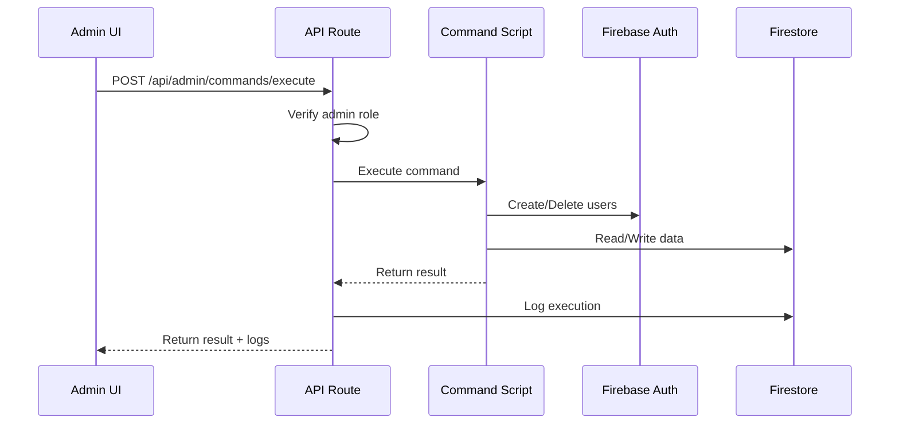

# Admin Commands Documentation

## Overview

The Admin Commands system provides a web interface for executing administrative tasks such as seeding demo data, managing test users, and cleaning up the database.

## Features

- **Web-based execution**: Execute commands directly from the admin interface
- **Real-time output**: View command execution progress in real-time
- **Confirmation dialogs**: Destructive operations require explicit confirmation
- **Command logging**: All executions are logged to Firestore with timestamps
- **Command history**: View recent command executions with metadata
- **Role-based access**: Only admins can execute commands

## Available Commands

### 1. Seed Fake Users
**Icon:** 👥
**Destructive:** No
**Description:** Generate 10 fake users with sample data for testing

**Creates:**
- 10 Firebase Auth users (email/password)
- User profile documents in Firestore
- User stats documents with sample data

**User Details:**
- Email format: `fake_user_N@oraapp.test` (N = 1-10)
- Password: `Test123!` (all users)
- Mix of free and premium users
- Varied stats (sessions, streaks, badges)

### 2. Purge Fake Users
**Icon:** 🗑️
**Destructive:** Yes
**Description:** Remove all fake users created by seedFakeUsers command

**Deletes:**
- All Firebase Auth users with email prefix `fake_user_`
- Associated Firestore profile documents
- Associated Firestore stats documents
- Associated gratitude entries
- Associated user program records

**Confirmation:** Required

### 3. Seed Sample Content
**Icon:** 📚
**Destructive:** No
**Description:** Add sample meditation/yoga programs and lessons to the database

**Creates:**
- 6 sample programs (meditation, yoga, breathing, sleep)
- 100+ lesson documents
- Mix of free and premium content
- Properly structured program/lesson relationships

**Programs:**
- Meditation for Beginners (7 sessions, free)
- Morning Yoga Flow (21 sessions, premium)
- Breathing for Stress Relief (10 sessions, free)
- Sleep Better Tonight (14 sessions, premium)
- Advanced Meditation Mastery (30 sessions, premium)
- Yoga for Flexibility (12 sessions, free)

### 4. Wipe Demo Data
**Icon:** ⚠️
**Destructive:** Yes
**Description:** Delete all demo data (fake users + sample content)

**Deletes:**
- All fake users (via purgeFakeUsers)
- All programs
- All lessons
- All user program records

**Confirmation:** Required (with strong warning)

## Usage

### Via Web Interface

1. Navigate to **Admin > Commands** in the admin dashboard
2. Click **Execute** on the desired command
3. For destructive commands, confirm the action in the dialog
4. View real-time output as the command executes
5. Check the **Command History** section for past executions

### Via CLI (Direct Script Execution)

```bash
# Seed fake users
npx ts-node scripts/seed-fake-users.ts

# Purge fake users
npx ts-node scripts/purge-fake-users.ts

# Seed sample content
npx ts-node scripts/seed-sample-content.ts

# Wipe all demo data
npx ts-node scripts/wipe-demo-data.ts
```

## Command Execution Flow



## Command Logging

All command executions are logged to Firestore in the `commandLogs` collection:

```typescript
{
  id: string;
  commandName: CommandName;
  status: 'success' | 'error';
  startedAt: string; // ISO timestamp
  completedAt: string; // ISO timestamp
  executedBy: {
    uid: string;
    email: string;
  };
  output: string[];
  error?: string;
  duration: number; // milliseconds
  metadata?: {
    usersCreated?: number;
    usersDeleted?: number;
    programsCreated?: number;
    lessonsCreated?: number;
    // ... other command-specific metadata
  };
}
```

## Security

### Authentication
- All command endpoints require admin authentication
- Token verification via Firebase Admin SDK
- Role-based access control (RBAC)

### Authorization
- Only users with `admin` role can access `/admin/commands`
- Permission check: `canRunCommands` must be `true`
- Confirmation required for destructive operations

### Audit Trail
- All executions logged with user info
- Timestamps for accountability
- Output and error messages preserved

## Error Handling

### Script-level Errors
- Individual operation failures are caught and logged
- Scripts continue execution when possible
- Metadata includes success/failure counts

### API-level Errors
- 400: Invalid command name or missing parameters
- 401: Unauthorized (not logged in)
- 403: Forbidden (not admin)
- 500: Internal server error

## File Structure

```
OraWebApp/
├── app/
│   ├── admin/
│   │   └── commands/
│   │       └── page.tsx              # Admin commands UI
│   └── api/
│       └── admin/
│           └── commands/
│               ├── execute/
│               │   └── route.ts      # Command execution API
│               └── logs/
│                   └── route.ts      # Command logs API
├── scripts/
│   ├── seed-fake-users.ts            # Seed fake users script
│   ├── purge-fake-users.ts           # Purge fake users script
│   ├── seed-sample-content.ts        # Seed sample content script
│   └── wipe-demo-data.ts             # Wipe demo data script
├── lib/
│   └── types/
│       └── commands.ts                # Command type definitions
└── components/
    └── ui/
        └── alert-dialog.tsx           # Confirmation dialog component
```

## Adding New Commands

To add a new command:

1. **Create the script** in `scripts/`:
```typescript
import type { CommandResult } from '../lib/types/commands';

export async function myNewCommand(): Promise<CommandResult> {
  const output: string[] = [];
  const metadata: Record<string, any> = {};

  try {
    output.push('Starting my command...');

    // Your logic here

    output.push('Command complete!');
    return { success: true, output, metadata };
  } catch (error: any) {
    output.push(`ERROR: ${error.message}`);
    return { success: false, output, error: error.message, metadata };
  }
}
```

2. **Add to COMMANDS enum** in `lib/types/commands.ts`:
```typescript
export type CommandName =
  | 'seedFakeUsers'
  | 'purgeFakeUsers'
  | 'seedSampleContent'
  | 'wipeDemoData'
  | 'myNewCommand'; // Add here

export const COMMANDS: Record<CommandName, CommandDefinition> = {
  // ... existing commands
  myNewCommand: {
    name: 'myNewCommand',
    displayName: 'My New Command',
    description: 'Description of what it does',
    destructive: false,
    icon: '🚀',
  },
};
```

3. **Add to API route** in `app/api/admin/commands/execute/route.ts`:
```typescript
import { myNewCommand } from '@/scripts/my-new-command';

// In switch statement:
case 'myNewCommand':
  result = await myNewCommand();
  break;
```

## Best Practices

1. **Always test in development** before running in production
2. **Use confirmation dialogs** for destructive operations
3. **Provide detailed output** for transparency
4. **Include metadata** for auditing and debugging
5. **Handle errors gracefully** and continue when possible
6. **Log all executions** for accountability
7. **Use batched operations** for large datasets (Firestore limit: 500/batch)
8. **Verify data** before deleting

## Troubleshooting

### Command fails to execute
- Check browser console for errors
- Verify you're logged in as admin
- Check API route logs in server console

### Partial execution
- Check command logs for detailed error messages
- Review metadata for success/failure counts
- Re-run command if safe (idempotent operations)

### Firestore batch limit exceeded
- Scripts use batching for operations >500
- If custom script fails, implement batching:
```typescript
const batch = db.batch();
let count = 0;

docs.forEach((doc) => {
  batch.delete(doc.ref);
  count++;

  if (count === 500) {
    await batch.commit();
    batch = db.batch();
    count = 0;
  }
});

if (count > 0) {
  await batch.commit();
}
```

## Related Documentation

- [RBAC System](./RBAC.md)
- [Firestore Setup](./FIRESTORE_SETUP.md)
- [API Authentication](./API_AUTH.md)

## Support

For issues or questions:
1. Check command logs in Firestore
2. Review server logs
3. Verify Firebase Admin SDK setup
4. Check RBAC permissions
