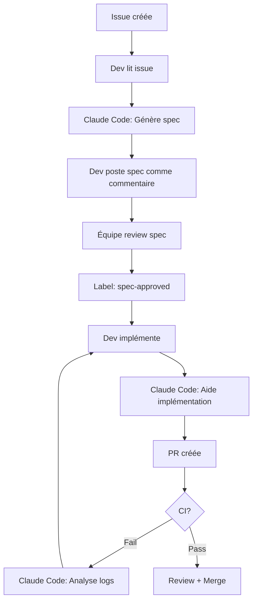

# 🤖 Intégration Claude Code (Alternative à l'API)

## Vue d'ensemble

Avec **Claude Code Pro**, vous n'avez pas besoin de clé API Anthropic. Cette approche utilise Claude Code **localement** pour les tâches de développement.

## 🔄 Deux Approches Possibles

### Approche 1: Claude Code Local (Recommandée pour vous) ✅

**Avantages**:
- ✅ Pas de clé API requise
- ✅ Utilise votre abonnement Claude Code Pro
- ✅ Interface familière
- ✅ Plus de contrôle

**Comment l'utiliser**:

#### 1. Génération de Specs
Au lieu du workflow automatique, utilisez Claude Code manuellement:

```bash
# Quand une issue est créée
# 1. Lire l'issue sur GitHub
# 2. Dans Claude Code:
"Génère une spec technique pour cette feature request:

Title: [copier titre issue]
Body: [copier corps issue]

Contexte codebase:
- Next.js 15 + TypeScript
- Firebase (Firestore, Auth, Storage)
- Voir structure dans docs/

Format la spec selon le template dans .github/ISSUE_TEMPLATE/spec.yml"

# 3. Copier la spec générée comme commentaire sur l'issue
# 4. Ajouter label "spec-generated"
```

#### 2. Analyse d'Échecs Tests
```bash
# Quand CI échoue
# 1. Copier les logs d'erreur
# 2. Dans Claude Code:
"Analyse ces échecs de tests et suggère des fixes:

[coller logs]

Projet: Next.js 15 + TypeScript + Firebase
Tests: Vitest + Playwright"

# 3. Implémenter les fixes suggérés
```

#### 3. Review de Code
```bash
# Avant de créer une PR
"Review ce code pour:
- Sécurité (Firestore rules, secrets)
- Performance
- Best practices TypeScript/React
- Tests

[coller le diff]"
```

### Approche 2: GitHub Actions avec API (Optionnel)

Si vous voulez l'automatisation complète, vous pouvez obtenir une clé API Anthropic:

1. Aller sur https://console.anthropic.com/
2. Créer une clé API
3. Ajouter aux secrets GitHub (`CLAUDE_API_KEY`)
4. Les workflows s'exécuteront automatiquement

**Coût**: ~$0.01-0.05 par spec générée (Claude 3.5 Sonnet)

## 🎯 Workflow Recommandé (Sans API)



## ✅ Configuration Simplifiée

### Désactiver les Workflows IA (optionnel)

Si vous voulez utiliser uniquement Claude Code local:

1. **Désactiver Spec Assistant**:
```yaml
# .github/workflows/spec-assistant.yml
# Ajouter au début:
on:
  workflow_dispatch:  # Manuel uniquement
# Supprimer: issues: types: [opened, edited, labeled]
```

2. **Désactiver AI Test Analysis**:
```yaml
# .github/workflows/ci.yml
# Commenter le job "ai-triage"
```

### Garder les Workflows Utiles

Gardez actifs:
- ✅ **ci.yml** (tests, lint, build) - Pas besoin d'API
- ✅ **security.yml** (CodeQL, audit) - Pas besoin d'API
- ✅ **release.yml** (changelog) - Pas besoin d'API

## 📋 Templates Claude Code

### Template: Génération de Spec

```
Tu es l'architecte technique pour Ora Admin Portal.

Contexte projet:
- Stack: Next.js 15 (App Router) + TypeScript 5.7 + Firebase
- Architecture: Clean Architecture, MVVM
- Database: Firestore (camelCase fields)
- Auth: Firebase Auth (RBAC: admin/teacher/viewer)
- Storage: Firebase Storage (media uploads)
- Tests: Vitest (unit) + Playwright (E2E)

Feature request:
[COLLER ICI LE CONTENU DE L'ISSUE]

Génère une spec technique avec:

## 1. Overview
[Résumé 2-3 phrases]

## 2. Architecture & Design
### Components
- Liste des composants React
- API routes
- Cloud Functions (si besoin)

### Data Flow
[Diagramme textuel du flux de données]

### Design Patterns
[Patterns utilisés: repository, observer, etc.]

## 3. API Contracts
```typescript
// Définir les endpoints avec TypeScript
POST /api/...
Body: { ... }
Response: { ... }
```

## 4. Data Models
```typescript
// Firestore collections
interface MyCollection {
  // camelCase fields
}
```

## 5. Security Considerations
- Firestore rules à mettre à jour
- Validation inputs
- RBAC checks

## 6. Performance Considerations
- Caching strategy
- Query optimization
- Bundle size impact

## 7. Testing Strategy
### Unit Tests (Vitest)
- [Liste des tests]

### E2E Tests (Playwright)
- [Scénarios à tester]

## 8. Implementation Tasks
- [ ] Task 1
- [ ] Task 2
...
```

### Template: Analyse d'Échecs Tests

```
Contexte:
- Projet: Ora Admin Portal (Next.js 15 + TypeScript + Firebase)
- Tests: [Vitest/Playwright]

Logs d'erreur:
[COLLER LES LOGS]

Analyse:
1. Root Cause - Quelle est la cause probable?
2. Suggested Fix - Code précis pour corriger
3. Prevention - Comment éviter ce problème à l'avenir?

Format avec code blocks TypeScript.
```

### Template: Code Review

```
Review ce code pour Ora Admin Portal:

Fichier: [nom du fichier]

```typescript
[COLLER LE CODE]
```

Check:
1. Security
   - Firestore fields en camelCase?
   - Pas de secrets exposés?
   - Validation inputs?
   - RBAC correct?

2. Performance
   - Queries optimisées?
   - Pas de re-renders inutiles?
   - Lazy loading si pertinent?

3. Best Practices
   - TypeScript strict?
   - Error handling?
   - Tests suffisants?

4. Firebase Patterns
   - Repository pattern?
   - Offline-first si applicable?
   - Security rules à jour?

Suggestions d'amélioration?
```

## 🎓 Bonnes Pratiques

### 1. Documenter les Specs

Même sans automation, documentez les specs:
```bash
# Créer un fichier pour chaque feature
docs/specs/FEAT-001-bulk-upload.md

# Y coller la spec générée par Claude Code
# Commit dans le repo pour référence
```

### 2. Labels GitHub

Utilisez les labels manuellement:
- `spec-needed` → Feature attend une spec
- `spec-generated` → Spec créée (par Claude Code)
- `spec-approved` → Spec validée, prête à implémenter

### 3. PR Reviews

Avant chaque PR, demandez à Claude Code:
```
"Review ce diff avant que je crée la PR:

[git diff]

Focus sur sécurité Firebase et best practices TypeScript"
```

## 📊 Comparaison

| Aspect | API Automatique | Claude Code Manuel |
|--------|-----------------|-------------------|
| **Coût** | ~$5-10/mois | Inclus dans Pro |
| **Rapidité** | 30s automatique | 2-3min manuel |
| **Contrôle** | Moins | Plus |
| **Setup** | Clé API requise | Rien |
| **Qualité** | Très bonne | Excellente (contexte conversationnel) |

## 🚀 Démarrage Rapide (Sans API)

1. ✅ **Ignorer** la config `CLAUDE_API_KEY`
2. ✅ Garder les workflows CI/Security/Release
3. ✅ Désactiver `spec-assistant.yml` (ou laisser en workflow_dispatch)
4. ✅ Utiliser Claude Code pour:
   - Génération specs (copier dans issues)
   - Analyse erreurs tests
   - Code reviews
   - Implémentation features

## 💡 Exemple Complet

### Scénario: Feature "Bulk Upload"

1. **Issue créée**: #123 "Add bulk lesson upload"

2. **Dans Claude Code**:
```
"Génère une spec pour cette feature:
[coller issue #123]
"
```

3. **Copier la réponse** comme commentaire sur #123

4. **Ajouter label** `spec-generated`

5. **Review équipe** → `spec-approved`

6. **Dev implémente** avec aide Claude Code

7. **Avant PR**, review avec Claude Code:
```
"Review ce code:
[coller diff]
"
```

8. **PR créée** → CI passe automatiquement

9. **Si CI fail**, copier logs dans Claude Code pour analyse

10. **Merge** → Release notes auto (workflow)

---

**Conclusion**: Avec Claude Code Pro, vous avez tout ce qu'il faut **sans API**. Les workflows GitHub restent utiles pour CI/Security/Release, et Claude Code vous assiste manuellement pour les specs et reviews.

<sub>🤖 Créé avec Claude Code Pro</sub>
