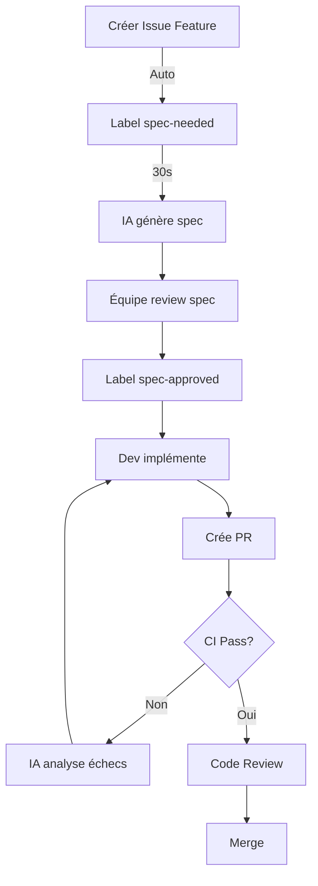
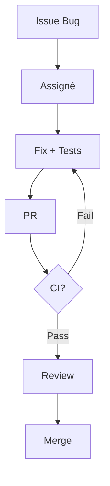

# 📋 GitHub Workflow Setup - Summary

## ✅ Ce qui a été créé

### 1. Issue Templates (`.github/ISSUE_TEMPLATE/`)

| Template | Usage | Labels Auto |
|----------|-------|-------------|
| **feature.yml** | Demandes de fonctionnalités avec user stories Gherkin | `feature`, `spec-needed` |
| **bug.yml** | Rapports de bugs détaillés (sévérité, fréquence) | `bug`, `needs-triage` |
| **spec.yml** | Spécifications techniques architecturales | `spec`, `documentation` |
| **config.yml** | Configuration (liens vers docs, discussions) | - |

### 2. GitHub Actions Workflows (`.github/workflows/`)

| Workflow | Déclencheur | Fonction |
|----------|-------------|----------|
| **ci.yml** | PR + push main | Tests, lint, build, type-check + AI analysis si échec |
| **spec-assistant.yml** | Label `spec-needed` | IA génère spec technique depuis issue |
| **security.yml** | PR + hebdo lundi 9h | CodeQL, audit dépendances, scan secrets |
| **release.yml** | Tag `v*.*.*` | Génère changelog + release notes |

### 3. Documentation

| Fichier | Contenu |
|---------|---------|
| **.github/CONTRIBUTING.md** | Guide complet contribution avec workflow AI |
| **.github/PULL_REQUEST_TEMPLATE.md** | Template PR exhaustif (tests, sécurité, déploiement) |
| **docs/GITHUB_WORKFLOW_SETUP.md** | Guide setup complet étape par étape |
| **.github/workflows/README.md** | Documentation workflows Actions |

### 4. Architecture Decision Records (ADRs)

| ADR | Sujet | Statut |
|-----|-------|--------|
| **001-nextjs-app-router.md** | Choix Next.js 15 App Router | ✅ Accepted |
| **002-firebase-backend.md** | Choix Firebase comme backend | ✅ Accepted |
| **template.md** | Template pour futurs ADRs | - |

### 5. Scripts

| Script | Usage |
|--------|-------|
| **.github/scripts/claude-api.py** | Intégration Claude API (spec, test analysis) |

## 🚀 Prochaines Étapes (Actions Manuelles Requises)

### 1. Ajouter les Secrets GitHub ⚠️ REQUIS

**Settings → Secrets and variables → Actions → New repository secret**

| Secret | Valeur | Obligatoire |
|--------|--------|-------------|
| `CLAUDE_API_KEY` | Clé API Anthropic (console.anthropic.com) | ✅ Oui |

### 2. Configurer Branch Protection ⚠️ REQUIS

**Settings → Branches → Add branch protection rule**

Pour `main`:
- ✅ Require pull request reviews (1 approval)
- ✅ Require status checks:
  - `TypeScript Type Check`
  - `Lint Code`
  - `Unit Tests`
  - `Build Application`
- ✅ Require conversation resolution
- ✅ Do not allow bypassing

### 3. Activer GitHub Actions

**Settings → Actions → General**

- ✅ Allow all actions
- ✅ Read and write permissions
- ✅ Allow Actions to create PRs

### 4. Tester le Setup

```bash
# 1. Créer une issue de test
# Issues → New → "Feature Request"
# Remplir le template et soumettre

# 2. Vérifier que Spec Assistant fonctionne
# L'IA devrait poster un commentaire en ~30s

# 3. Créer une PR de test
git checkout -b test/github-workflows
git commit --allow-empty -m "test: Verify CI workflows"
git push origin test/github-workflows
# Ouvrir PR sur GitHub

# 4. Vérifier que CI passe
# Actions tab → Voir les workflows

# 5. Merger la PR test
```

## 📊 Workflow de Développement

### Pour une Feature



### Pour un Bug



### Pour une Release

```bash
# Tag → Changelog auto → Release GitHub
git tag v1.2.0
git push origin v1.2.0
```

## 🤖 Fonctionnalités IA

### 1. Génération de Spec

**Input** (issue):
- User story: "En tant que... je veux... afin de..."
- Critères acceptation: Gherkin (Given/When/Then)
- Impacts techniques

**Output** (IA):
- Architecture & design (composants, data flow)
- Contrats API (TypeScript schemas)
- Modèles de données (Firestore)
- Règles sécurité
- Stratégie tests
- **Checklist implémentation**

### 2. Analyse Échecs Tests

**Input**: Rapport tests (JSON Vitest/Playwright)

**Output**:
- Cause racine
- Fix suggéré (code précis)
- Prévention future

### 3. Security Audit

**Hebdomadaire** (lundi 9h) + **chaque PR**:
- CodeQL (vulnérabilités code)
- npm audit (dépendances)
- Secret scan (clés API)
- Firebase rules validation

## 📁 Structure Complète

```
.github/
├── ISSUE_TEMPLATE/
│   ├── feature.yml          ✅ Feature requests
│   ├── bug.yml              ✅ Bug reports
│   ├── spec.yml             ✅ Technical specs
│   └── config.yml           ✅ Config
├── workflows/
│   ├── ci.yml               ✅ CI/CD pipeline
│   ├── spec-assistant.yml   ✅ AI spec generation
│   ├── security.yml         ✅ Security audits
│   ├── release.yml          ✅ Release automation
│   └── README.md            ✅ Workflows doc
├── scripts/
│   └── claude-api.py        ✅ Claude API helper
├── CONTRIBUTING.md          ✅ Contribution guide
└── PULL_REQUEST_TEMPLATE.md ✅ PR template

docs/
├── GITHUB_WORKFLOW_SETUP.md ✅ Setup guide complet
├── GITHUB_SETUP_SUMMARY.md  ✅ Ce fichier
└── adr/
    ├── README.md            ✅ ADR index
    ├── template.md          ✅ ADR template
    ├── 001-nextjs-app-router.md ✅ Decision Next.js
    └── 002-firebase-backend.md  ✅ Decision Firebase
```

## 🎯 Avantages du Setup

### Pour les Développeurs
- ✅ Specs techniques générées automatiquement
- ✅ Feedback immédiat sur les erreurs (IA)
- ✅ Templates clairs pour issues/PRs
- ✅ Workflow standardisé et documenté

### Pour l'Équipe
- ✅ Traçabilité complète (issue → commit → release)
- ✅ Qualité forcée (tests, lint, reviews obligatoires)
- ✅ Sécurité renforcée (audits auto)
- ✅ Documentation vivante (ADRs, changelog auto)

### Pour le Projet
- ✅ Vélocité accrue (IA accélère)
- ✅ Moins d'erreurs (CI + reviews)
- ✅ Onboarding facilité (docs complètes)
- ✅ Décisions architecturales tracées (ADRs)

## 🔒 Principes de Sécurité

1. **Secrets GitHub uniquement**
   - ❌ Jamais commit `.env`
   - ✅ Utiliser GitHub Secrets

2. **IA = Assistant, pas décideur**
   - ⚠️ L'IA **suggère**, l'humain **décide**
   - ✅ Toujours reviewer code IA
   - ✅ Tests obligatoires

3. **Branch Protection**
   - 🔒 Main protégée
   - ✅ Review obligatoire
   - ✅ CI doit passer

## 📞 Support

### Problèmes Fréquents

| Problème | Solution |
|----------|----------|
| Spec Assistant ne fonctionne pas | Vérifier `CLAUDE_API_KEY` dans secrets |
| CI échoue sur build | Ajouter secrets Firebase (optionnel) |
| Tests timeout | Augmenter timeout dans `playwright.config.ts` |
| Impossible de merger | Vérifier status checks dans Actions |

### Ressources

- **Setup complet**: [docs/GITHUB_WORKFLOW_SETUP.md](./GITHUB_WORKFLOW_SETUP.md)
- **Workflows**: [.github/workflows/README.md](../.github/workflows/README.md)
- **Contributing**: [.github/CONTRIBUTING.md](../.github/CONTRIBUTING.md)
- **GitHub Actions docs**: https://docs.github.com/en/actions
- **Claude API docs**: https://docs.anthropic.com/

## ✅ Checklist Finale

Avant d'utiliser le workflow:

- [ ] ✅ Secrets ajoutés (`CLAUDE_API_KEY`)
- [ ] ✅ Branch protection configurée
- [ ] ✅ GitHub Actions activé
- [ ] ✅ Issue test créée (spec générée)
- [ ] ✅ PR test créée (CI passé)
- [ ] ✅ Équipe formée au workflow

## 🎉 Prêt à Utiliser !

Votre infrastructure GitHub est maintenant configurée pour un développement AI-assisted avec:

- 🤖 Génération automatique de specs
- ✅ CI/CD complet
- 🔒 Audits sécurité
- 📝 Documentation auto
- 🚀 Release automation

**Prochaine action**: Compléter les 3 étapes manuelles ci-dessus puis créer votre première feature request !

---

<sub>🤖 Généré avec [Claude Code](https://claude.com/claude-code)</sub>
<sub>📅 Date: 2025-10-24</sub>
