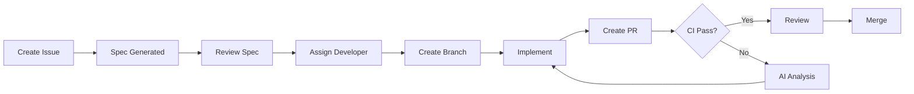

# 🚀 GitHub Workflow Setup Guide

Complete guide for setting up AI-assisted development workflows for Ora Admin Portal.

## 📖 Table of Contents

1. [Overview](#overview)
2. [Prerequisites](#prerequisites)
3. [Initial Setup](#initial-setup)
4. [Configuration](#configuration)
5. [Development Workflow](#development-workflow)
6. [Troubleshooting](#troubleshooting)

## 🎯 Overview

This setup provides:

- **Automated CI/CD**: Tests, linting, builds on every PR
- **AI Spec Generation**: Claude generates technical specs from feature requests
- **AI Test Analysis**: Automatic diagnosis of test failures
- **Security Audits**: CodeQL, dependency scanning, secret detection
- **Release Automation**: Changelog and release notes generation

**Philosophy**: AI-assisted, human-in-the-loop development

## ✅ Prerequisites

- GitHub repository for Ora Admin Portal
- Admin access to repository settings
- Anthropic API key (for Claude Code integration)
- Basic understanding of GitHub Actions

## 🔧 Initial Setup

### Step 1: Copy GitHub Configuration

All GitHub configuration is in the `.github/` directory:

```
.github/
├── ISSUE_TEMPLATE/           # Issue templates
│   ├── feature.yml          # Feature requests
│   ├── bug.yml              # Bug reports
│   ├── spec.yml             # Technical specs
│   └── config.yml           # Template config
├── workflows/                # GitHub Actions
│   ├── ci.yml              # CI/CD pipeline
│   ├── spec-assistant.yml  # AI spec generation
│   ├── security.yml        # Security audits
│   ├── release.yml         # Release automation
│   └── README.md           # Workflow docs
├── scripts/                  # Helper scripts
│   └── claude-api.py       # Claude API integration
├── PULL_REQUEST_TEMPLATE.md # PR template
└── CONTRIBUTING.md          # Contribution guide
```

**If starting fresh**, commit all these files to your repository.

### Step 2: Add GitHub Secrets

Go to: **Repository Settings → Secrets and variables → Actions → New repository secret**

Add:

| Secret Name       | Value                                                      | Required |
| ----------------- | ---------------------------------------------------------- | -------- |
| `CLAUDE_API_KEY`  | Your Anthropic API key from console.anthropic.com         | Yes      |

Optional (for builds):

| Secret Name                                | Value                     |
| ------------------------------------------ | ------------------------- |
| `NEXT_PUBLIC_FIREBASE_API_KEY`             | Firebase API key          |
| `NEXT_PUBLIC_FIREBASE_AUTH_DOMAIN`         | Firebase auth domain      |
| `NEXT_PUBLIC_FIREBASE_PROJECT_ID`          | Firebase project ID       |
| `NEXT_PUBLIC_FIREBASE_STORAGE_BUCKET`      | Firebase storage bucket   |
| `NEXT_PUBLIC_FIREBASE_MESSAGING_SENDER_ID` | Firebase messaging sender |
| `NEXT_PUBLIC_FIREBASE_APP_ID`              | Firebase app ID           |

**Note**: `GITHUB_TOKEN` is automatically provided by GitHub Actions.

### Step 3: Configure Branch Protection

Go to: **Settings → Branches → Add branch protection rule**

For branch `main`:

**Protect matching branches**:
- ✅ Require a pull request before merging
  - ✅ Require approvals: 1
  - ✅ Dismiss stale reviews
- ✅ Require status checks to pass before merging
  - ✅ Require branches to be up to date
  - Search and add:
    - `TypeScript Type Check`
    - `Lint Code`
    - `Unit Tests`
    - `Build Application`
- ✅ Require conversation resolution before merging
- ✅ Do not allow bypassing the above settings

**Save changes**

### Step 4: Enable GitHub Actions

Go to: **Settings → Actions → General**

**Actions permissions**:
- ✅ Allow all actions and reusable workflows

**Workflow permissions**:
- ✅ Read and write permissions
- ✅ Allow GitHub Actions to create and approve pull requests

**Save**

### Step 5: Test the Setup

Create a test issue to verify Spec Assistant works:

1. Go to **Issues → New issue**
2. Choose "🚀 Feature Request (Spec-Driven)"
3. Fill in the template
4. Submit
5. Wait ~30 seconds
6. Check for a comment with AI-generated spec

If it works: ✅ Setup complete!

## 🎯 Development Workflow

### For Feature Development



**Step-by-step**:

1. **Create Feature Request**
   - Use "🚀 Feature Request" template
   - Fill in user story, acceptance criteria
   - GitHub auto-adds `spec-needed` label

2. **AI Generates Spec**
   - Spec Assistant workflow runs (~30s)
   - Posts technical spec as comment
   - Label changes to `spec-generated`

3. **Human Reviews Spec**
   - Team discusses and refines spec
   - Update as needed
   - Add `spec-approved` label when ready

4. **Developer Implements**
   ```bash
   git checkout -b feat/bulk-upload
   # Implement following the spec
   git commit -m "feat(upload): Add bulk upload"
   git push origin feat/bulk-upload
   ```

5. **Create Pull Request**
   - Fill out PR template
   - Link issue: `Closes #123`
   - CI runs automatically

6. **CI Validation**
   - TypeScript check ✅
   - Linting ✅
   - Unit tests ✅
   - E2E tests ✅
   - Build ✅

7. **If Tests Fail**
   - AI analyzes failures
   - Posts suggestions as comment
   - Developer fixes and pushes

8. **Human Review**
   - Code review by maintainer
   - Address feedback
   - Get approval

9. **Merge**
   - Squash and merge
   - Auto-generates commit message from PR title

### For Bug Fixes

```bash
# 1. Create bug report (use template)
# 2. Get assigned
git checkout -b fix/cors-error
# 3. Fix the bug + add test
git commit -m "fix(upload): Resolve CORS error"
# 4. Push and create PR
git push origin fix/cors-error
# 5. CI validates
# 6. Merge
```

### For Releases

```bash
# Option 1: Tag-based release
git tag v1.2.0
git push origin v1.2.0
# → Triggers release workflow
# → Generates changelog
# → Creates GitHub release

# Option 2: Manual workflow trigger
# Go to Actions → Release & Changelog → Run workflow → Enter v1.2.0
```

## 🤖 AI-Assisted Features

### 1. Spec Generation

**Input** (from issue):
```markdown
## User Story
As a teacher
I want to upload multiple lessons at once
So that I can save time

## Acceptance Criteria
Given I am logged in as a teacher
When I select 5 video files
Then all files upload with progress indicators
```

**Output** (AI-generated):
```markdown
## Architecture & Design

### Components
- `BulkUploadDialog.tsx` - UI component
- `/api/lessons/bulk-upload` - Backend endpoint
- `batchTranscode` - Cloud Function

### Data Flow
1. User selects files → validation
2. Create batch job in Firestore
3. Generate signed URLs
4. Parallel uploads
5. Trigger transcoding

### Data Model
```typescript
interface BatchUploadJob {
  id: string;
  program_id: string;
  files: UploadFile[];
  status: 'pending' | 'uploading' | 'completed';
}
```

### Testing Strategy
- Unit: File validation logic
- Integration: API endpoint
- E2E: Full upload flow
```

### 2. Test Failure Analysis

**Input** (test failure):
```
Error: Upload failed - Network error (status: 0)
at CreateLessonDialog.tsx:165:18
```

**Output** (AI analysis):
```markdown
## Root Cause
CORS error: The browser is blocking the request to Firebase Storage
because the bucket doesn't have CORS configuration.

## Suggested Fix
Configure CORS for Firebase Storage bucket:

```json
[
  {
    "origin": ["http://localhost:3000"],
    "method": ["GET", "PUT"],
    "maxAgeSeconds": 3600
  }
]
```

Apply with: `gsutil cors set cors.json gs://bucket-name`

## Prevention
- Add CORS validation to setup checklist
- Document in Firebase setup guide
- Add E2E test for uploads
```

## 🐛 Troubleshooting

### Issue: Spec Assistant not running

**Symptoms**: No spec comment appears on issue

**Causes**:
1. `CLAUDE_API_KEY` not set → Add secret
2. Issue not labeled `spec-needed` → Add label manually
3. Workflow failed → Check Actions tab for errors

**Fix**:
```bash
# Check workflow runs
gh run list --workflow=spec-assistant.yml

# View logs
gh run view <run-id> --log
```

### Issue: CI failing on build

**Symptoms**: Build job fails with "Firebase not configured"

**Causes**: Missing Firebase environment variables

**Fix**: Either:
1. Add Firebase secrets (recommended for production)
2. Use dummy values (already configured in `ci.yml`)

### Issue: Tests timing out

**Symptoms**: E2E tests timeout after 30s

**Fix**: Increase timeout in `playwright.config.ts`:
```typescript
timeout: 60 * 1000, // 60 seconds
```

### Issue: AI analysis posting on wrong PR

**Symptoms**: Comment appears on different PR

**Causes**: Multiple PRs triggering workflow simultaneously

**Fix**: GitHub Actions handles this correctly; if not, check `PR_NUMBER` env var

### Issue: Branch protection blocking merge

**Symptoms**: Can't merge despite approvals

**Causes**: Required status check not passing

**Fix**:
1. Check which check failed (Actions tab)
2. Fix the issue locally
3. Push again
4. Wait for CI to pass

## 📊 Monitoring

### View Workflow Status

```bash
# List all workflows
gh workflow list

# View recent runs
gh run list --limit 10

# View specific workflow runs
gh run list --workflow=ci.yml

# Watch a run in progress
gh run watch <run-id>

# View detailed logs
gh run view <run-id> --log
```

### GitHub UI

Visit: `https://github.com/YOUR_ORG/OraWebApp/actions`

**Filters**:
- Status: Success, Failure, In progress
- Event: Pull request, Push, Schedule
- Branch: main, feat/*, fix/*

### Metrics to Track

- **CI Duration**: Should be <5 minutes
- **Test Pass Rate**: Aim for >95%
- **Spec Generation Success**: Should be 100%
- **Release Frequency**: Track releases per month

## 🔒 Security Best Practices

1. **Never commit secrets**
   - Use GitHub Secrets
   - Security workflow scans for this

2. **Review AI-generated code**
   - AI provides suggestions, humans decide
   - Always test AI changes

3. **Keep dependencies updated**
   - Security workflow audits weekly
   - Update vulnerable packages promptly

4. **Firestore rules in PR**
   - Always include rule changes in PR
   - Security workflow validates rules exist

## 📚 Next Steps

1. ✅ Complete this setup
2. Create your first feature request issue
3. Review the AI-generated spec
4. Implement a small feature to test the workflow
5. Create a release tag to test changelog generation
6. Customize workflows for your team's needs

## 🆘 Getting Help

- **Workflow docs**: [.github/workflows/README.md](./.github/workflows/README.md)
- **Contributing guide**: [.github/CONTRIBUTING.md](./.github/CONTRIBUTING.md)
- **GitHub Actions docs**: https://docs.github.com/en/actions
- **Claude API docs**: https://docs.anthropic.com/

---

**Setup complete!** 🎉 You're ready for AI-assisted development.

<sub>Built with ❤️ using Claude Code</sub>
